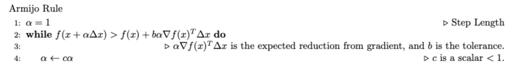
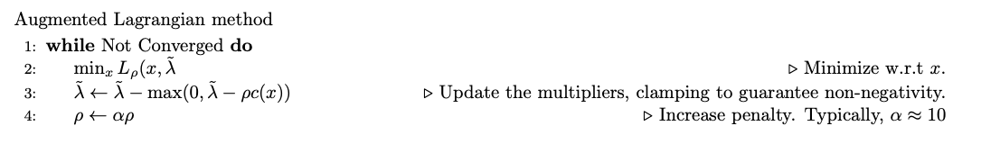

# Optimization

## Root finding

- Newton’s method $f(x + \Delta x) \approx f(x) + {\frac{\partial f}{\partial x}}{x} \Delta x = 0    \implies \Delta x = - (\frac{\partial f}{\partial x})^{-1} f(x)$
    - takeaway
        - Quadratic convergence rate, can achieve machine precision.
        - the most expensive part of this operation is solving a linear system O(n3)
            - could be accelerated with problem structure
        - function need to be Lipschitz continuous
- Line search
    - intuition: make Newton’s method not often over-shooting anymore
      
        
        
        - takeaway
            - Newton's method, with simple and cheap modifications or globalization strategies (such as regularization), is extremely effective at finding local minima.

## Minimization

### Unconstrained minimization

- if f is smooth, only need to solve $\frac{\partial f}{\partial x}({x^*}) = 0$ and make sure $\nabla^2 f > 0$
- Newton’s method
    - use Newton’s method to solve it
    - Damped Newton: **regularization** for a non-strong convex function (make sure the function goes to the right direction
      
        ```latex
        \While {$H \not> 0$} \Comment{Not positive definite.}
                    \State $H \gets H + \beta I$ \Comment{$\beta$ is a scalar hyperparameter.}
        ```
        
        - tips: use Cholesky decomposition to identify if the matrix is positive definite
        - the larger $\beta$ is, the function becomes more close to gradient decend, but this will also make the step smaller.
    - takeaway
        - we fit a quadratic approximation of f(x)
        - only find the local minimum

### Equality Constrained minimization

$$
    \min_x f(x) \ \ ; \ \ f(x) : \mathbb{R}^n \longrightarrow \mathbb{R} \\    \ni c(x) = 0 \ \ ; \ \ c(x) :  \mathbb{R}^n \longrightarrow \mathbb{R}^m
$$

- first-order conditions （Karush–Kuhn–Tucker (KKT) conditions, first derivative tests (sometimes called first-order necessary conditions) for a solution in nonlinear programming to be optimal)

$$
L(x,\lambda) = f(x) + \lambda^T c(x) \\
\nabla_x L(x,\lambda) = \nabla f + (\frac{\partial c}{\partial x})^T \lambda = 0 \\
    \nabla_{\lambda} L(x,\lambda) = c(x) = 0
$$

- KKT system Hessian Matrix → Might not be convex anymore → need extra regularization

$$
\begin{align*}    \begin{bmatrix}        \frac{\partial^2 L}{\partial x^2}  &  (\frac{\partial c}{\partial x})^T \\        \frac{\partial c}{\partial x} & 0     \end{bmatrix}    \begin{bmatrix}        \Delta x \\        \Delta \lambda    \end{bmatrix}    =     \begin{bmatrix}        -\nabla_x L(x,\lambda) \\        - c(x)    \end{bmatrix}\end{align*}
$$

- Newton’s method (the same as before)
- Gauss-Newton’s method
    - since term     $\frac{\partial^2 L}{\partial x^2} = \nabla^2 f + \frac{\partial}{\partial x} \big[ (\frac{\partial c}{\partial x})^T \lambda \big]$ is expensive to calculate, so we drop $\frac{\partial}{\partial x} \big[ (\frac{\partial c}{\partial x})^T \lambda \big]$
    - converge a little slower but still better than linear
    - might violate the restriction during the iteration, but the final result should be right.
    - Haissian stay positive definite (if use Newton’s method, need to regularize the Haissian)

### 📚 Inequality Constrained Minimization

Consider the optimization problem:

$$
\min_x f(x) 
$$
subject to:
$$
c(x) \geq 0
$$

#### 📝 KKT Conditions

The Karush-Kuhn-Tucker (KKT) conditions for this problem are:

1. **Stationarity**:
$$
\nabla f - \left( \frac{\partial c}{\partial x} \right)^T \lambda = 0
$$

2. **Primal Feasibility**:
$$
c(x) \geq 0
$$

3. **Dual Feasibility**:
$$
\lambda \geq 0
$$

4. **Complementarity (Non-linear)**:
$$
\lambda^T c(x) = 0
$$

#### 🧠 Intuition

- When the constraint is **active** (i.e., \(c(x) = 0\)), then \(c(x) = 0 \implies \lambda > 0\). This mirrors the equality constraint scenario.
  
- When the constraint is **inactive** (i.e., \(c(x) < 0\)), then \(c(x) < 0 \implies \lambda = 0\). This is analogous to the unconstrained case.
  
- The complementarity condition ensures that either \( \lambda \) or \( c(x) \) is zero, effectively acting as an "on/off switch" for constraints.

#### 🛠 Optimization Algorithms

1. **Active-Set Methods**:
    - This method tries different combinations of active constraints using a heuristic function.
    - It is most effective when there's a good understanding of which constraints are active or inactive.
    - It solves the equality constrained problem when the constraint is active.
    - It can be extremely fast with a good heuristic but can be combinatorially challenging without knowledge of active constraints.

2. **Barrier Methods**:
    - This method replaces the inequalities with a barrier function in the objective that becomes infinite at the constraint boundary (inside the boundary).
    - It is the gold standard for small to medium-sized convex problems.
    - It requires various hacks and tricks to work for non-convex problems.

3. **Penalty Method**:
    - This method replaces the inequality constraint with an objective term that penalizes constraint violations (outside the boundary).
    - It's straightforward to implement.
    - It can be ill-conditioned, causing Newton's method to struggle.
    - Achieving high accuracy can be challenging.

4. **Augmented Lagrangian**:
    - The objective function becomes:
    $$
    \min_x f(x) - \tilde{\lambda}^T c(x) + \frac{\rho}{2} \left[ \min(0,c(x)) \right]^2
    $$
    - Intuition:
        - Positive \( \lambda \) values indicate that when the constraint is violated (i.e., \(c < 0\)), \(c(x)\) should be increased.
        - \( \lambda = 0 \) when the constraint is not activated.
        - Initially, \( \lambda = 0 \), ignoring all constraints.
        - If \( c(x) < 0 \), \( \lambda \) should be increased to penalize constraints. In each iteration, \( \rho \) is increased to enhance the penalty, but it shouldn't be made too large to avoid ill-conditioning.
    - First, minimize with respect to \( x \).
    - Then, update \( \lambda \) by offloading the penalty:
    $$
    \frac{\partial f}{\partial x} - \left[ \tilde{\lambda} - \rho c(x) \right]^T \frac{\partial c}{\partial x} = 0 \implies \tilde{\lambda} \gets \tilde{\lambda} - \rho c(x) \ \text{for active constraints}.
    $$
    - Takeaways:
        - This method addresses the ill-conditioning issues of the penalty method.
        - It converges quickly (super-linearly) to moderate precision.
        - It performs well on non-convex problems.
    - Notes:
        - More robust to initial guesses.
        - Hyper-linear convergence, but relatively slower.

    

5. **Quadratic Programming**:
    - The optimization problem is:
    $$
    \min_x \ \frac{1}{2} x^T Q x + q^T x
    $$
    subject to:
    $$
    Q > 0 \ \text{(Convex)}
    $$
    and
    $$
    Ax \leq b
    $$
    and
    $$
    Cx = d
    $$

## 📚 Regularization and Duality

In the context of non-convex optimization problems, we often encounter the following formulation:

$$
\min_x f(x) 
$$
subject to:
$$
c(x) = 0
$$

### 🚫 Avoiding Local Minima in Convex Cases

To prevent getting trapped in local minima in convex scenarios, consider the following strategies:

1. **Infinity Penalty Approach**: 
    - Reinterpret the problem using an infinity penalty:
    $$ 
    \min_x f(x) + P_{\infty} (c(x))
    $$
    where:
    $$ 
    P_{\infty} (x) = \begin{cases} 
    0, & \text{if } x=0 \\
    \infty, & \text{if } x \neq 0 
    \end{cases}
    $$
    - This can be equivalently expressed as:
    $$ 
    \min_x \max_{\lambda \ge 0} f(x) + \lambda^T c(x)
    $$
    - The KKT conditions define a saddle point in the space of $(x, \lambda)$. Specifically:
        - The KKT system should have **$\dim(x)$ positive eigenvalues** (since x is minimized) and **$\dim(\lambda)$ negative eigenvalues** at an optimum. Such systems are termed as "Quasi-definite" linear systems.
        - This insight provides a method to avoid problematic Hessian matrices by adding a positive number to the x diagonal and a negative value to the lambda diagonal.

2. **Regularizing the KKT System**: 
    - When regularizing a KKT system, ensure the lower-right block is negative to maintain the system as quasi-definite:
    $$
    \begin{bmatrix} 
    H + \alpha I & C^T \\ 
    C & -\alpha I 
    \end{bmatrix} 
    \begin{bmatrix} 
    \Delta x \\ 
    \Delta \lambda 
    \end{bmatrix} 
    = 
    \begin{bmatrix} 
    -\nabla_x L \\ 
    - c(x) 
    \end{bmatrix}
    $$
    where $\alpha > 0$.

### 🚀 Avoiding Overshooting

To prevent overshooting:

1. **Merit Functions**: 
    - Use scalar merit functions to gauge the proximity to the final solution. 
    - Common choices include:
        - $P(x) = \frac{1}{2} c(x)^T c(x) = \frac{1}{2} || c(x) ||_{2}^2$
        - $P(x) = || c(x) ||_{1}$
        - For unconstrained optimization, the merit function can be $f(x)$.

2. **Constrained Minimization**:
    - Given the problem:
    $$
    \min_x f(x) 
    $$
    subject to:
    $$
    c(x) \geq 0, \quad d(x) = 0
    $$
    the Lagrangian is:
    $$
    L(x, \lambda, \mu) = f(x) - \lambda^T c(x) + \mu^T d(x)
    $$
    - Several merit functions can be employed. For instance:
        - $P(x, \lambda, \mu) = \frac{1}{2} || \nabla L(x, \lambda, \mu) ||_2^2$
        - $P(x, \lambda, \mu) = f(x) + \rho \ || \begin{bmatrix} \min (0,c(x)) \\ d(x) \end{bmatrix} ||_1$
        - $P(x, \lambda, \mu) = f(x) - \tilde{\lambda}^T c(x) + \tilde{\mu}^T d(x) + \frac{\rho}{2} || \min(0,c(x) ||_2^2 + \frac{\rho}{2} || d(x) ||_2^2$

## 🕐 Deterministic Optimal Control

### Continuous Time

Given the problem:

$$
\min_{x(t), u(t)} \int_{0}^{t} l(x,y) dt + l_F(x(t_f))
$$
subject to:
$$
\dot{x} = f(x,u)
$$

**Notes**:
- This represents an infinite-dimensional problem.
- Solutions are typically open-loop in the form of $u(t)$.
- Various methods exist to utilize the solution, including MPC and offline solutions with feedback.

### Discrete Time

Consider the problem:

$$
\min_{x_{1:N}, u_{1:N-1}} \sum_{k=0}^{N-1} l(x_k,y_k) + l_F(x_N)
$$
subject to:
$$
x_{n+1} = f(x_n,u_n), \quad C(x_n) \le 0, \quad u_\text{min} \le u_k \le u_\text{max}
$$

**Notes**:
- This is a finite-dimensional problem.
- The terms $x_n$ and $u_n$ are referred to as knot points.

