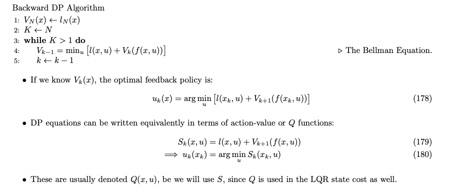

# 🚀 Linear Quadratic Regulator (LQR)

Linear Quadratic Regulator (LQR) provides a framework for modeling dynamic systems and optimizing their behavior over time.

## 📖 Introduction to LQR

The LQR problem is formulated as:

$$
\min_{x_{1:N}, u_{1:N-1}} \sum_{k=1}^{N-1} \left[ \frac{1}{2} x_k^T Q x_k + \frac{1}{2} u_k^T R_k u_k  \right] + \frac{1}{2} x_N^T Q_N x_N
$$

subject to:

$$
x_{k+1} = A_k x_k + B_k u_k, \; Q \geq 0, \; R > 0
$$

**Key Insights**:
- LQR can (locally) approximate many non-linear problems, making it a widely used approach.
- There are numerous extensions of LQR, such as the infinite horizon case and stochastic LQR.

## 🎯 LQR via Shooting Method

Using the Hamiltonian definition, we derive:

$$
\begin{align}
    x_{k+1} &= A x_k + B u_k \\
    \lambda_k &= Q x_k + A^T \lambda_{k+1}, \ \lambda_N = Q x_N \\
    u_{k} &= -R^{-1} B^T \lambda_{k+1}
\end{align}
$$

**Procedure for LQR with Indirect Shooting**:
1. Start with an initial guess trajectory.
2. Simulate (or "rollout") to obtain $x(t)$.
3. Perform a backward pass to compute $\lambda(t)$ and $\Delta u(t)$.
4. Rollout with a line search on $\Delta u$.
5. Repeat step (3) until convergence.

## 📊 LQR as a Quadratic Program (QP)

The standard QP is given by:

$$
\begin{align}
    \min_{z} \frac{1}{2} z^T H z \quad \text{subject to} \quad C z = d
\end{align}
$$

For the dynamic case, we can represent:

$$
z = \begin{bmatrix}
        u_1 \\
        x_2 \\
        u_2 \\
        \vdots \\
        x_N
    \end{bmatrix}
\quad
H = \begin{bmatrix}
        R_1 & 0   & \dots & 0 \\
        0   & Q_2 & \dots & 0 \\
        \vdots & \vdots & \ddots & \vdots \\
        0   & 0   & \dots & Q_N
    \end{bmatrix}
\quad
J = \frac{1}{2} z^T H z
$$

**Constraints**:

$$
C = \begin{bmatrix}
        B_1 & (-I)  & \dots   & 0 \\
        0   & A     & B     & (-I)  & \dots   & 0 \\
        \vdots & \vdots & \ddots & \vdots \\
        0   & 0     & \dots   & A_{N-1} & B_{N-1} & (-I)
    \end{bmatrix}
\quad
d = \begin{bmatrix}
        -A_1 x_1 \\
        0 \\
        \vdots \\
        0
    \end{bmatrix}
\quad
C z = d
$$

The Lagrangian of this QP is:

$$
L(z, \lambda) = \frac{1}{2} z^T H z + \lambda^T \left[ C z - d \right]
$$

From the KKT conditions:

$$
\begin{align}
    \nabla_z L &= H z + C^T \lambda = 0 \\
    \nabla_{\lambda} L &= C z - d = 0 
\end{align}
$$

Solving this KKT system yields:

$$
    \begin{bmatrix}
        H & C^T \\ 
        C & 0 
    \end{bmatrix}
    \begin{bmatrix}
        z \\
        \lambda
    \end{bmatrix}
    = 
    \begin{bmatrix}
        0 \\
        d
    \end{bmatrix}
$$

## 🔄 Riccati Recursion

The QP KKT system is notably sparse and structured, leading to the Riccati equation/recursion:

$$
\begin{align}
    P_N &= Q_N \\
    K_n &= (R + B^T P_{n+1} B)^{-1} B^T P_{n+1} A \\
    P_n &= Q + A^T P_{n+1} (A - BK_n)
\end{align}
$$

From which we can derive:

$$
\begin{align}
    \lambda_n &= P_n x_n \\
    u_n &= -K_n x_n 
\end{align}
$$

This provides a feedback policy.

## 🌌 Infinite Horizon LQR

For time-invariant LQR problems:
- The $K$ matrices converge to constant values over an infinite horizon.
- For stabilization tasks, the constant $K$ is predominantly used.
- This can be viewed as a root-finding or fixed point problem using Newton’s method, where $P_n=P_{n+1}=P_{\inf}$.
- This can be explicitly solved using tools like Julia or Matlab with the `dare` function.

## Dynamic Programming 📘

### Bellman’s Principle 📜

- 🌟 **Principle of Time Dependency**: Past control inputs can influence future states, but future control inputs cannot alter past states.
  
- 🌟 **Bellman's Principle of Optimality**: This principle is a direct consequence of the time dependency. It states that sub-trajectories of optimal trajectories must also be optimal for the corresponding sub-problem.

### Methodology

- 🔄 **Backward Recursive Programming**: This is a method used to determine the optimal solution.

- 📈 **Optimal Cost-to-Go (Value Function)**: Denoted as $V_N(x)$.

### Example: Linear Quadratic Regulator (LQR) 📐

1. **Last Step Value**: 
    $$ V_N(x) = \frac{1}{2} x^T Q_N x = \frac{1}{2} x^T P_N x $$

2. **Backup One Step**:
    $$ V_{N-1} = \min_u \frac{1}{2} x_{N-1}^T Q x_{N-1} + \frac{1}{2} u^T R u + V_N (A_{N-1} x_{N-1} + B_{N-1} u) $$
    - Optimal Control:
        $$ u_{N-1} = -K_{N-1} x_{N-1} $$
        where
        $$ K_{N-1} = (R_{N-1} + B_{N-1}^T Q_N B_{N-1})^{-1} B_{N-1}^T Q_N A_{N-1} $$

    - Define the Matrix $P_{N-1}$:
        $$ P_{N-1} = (Q_{N-1} + K_{N-1}^T R_{N-1} K + (A_{N-1} - B_{N-1} K_{N-1})^T Q_N (A_{N-1} - B_{N-1} K_{N-1}) ) $$

    - Value Function:
        $$ V_{N-1}(x) = \frac{1}{2} x^T P_{N-1} x $$

    - 🔄 **Recursive Solution**: This process can be repeated to find the solution recursively.

### Algorithm 🖥️

### Key Takeaways

- ✅ **Global Optimum**: Dynamic Programming (DP) guarantees a global optimum.

- ⚠️ **Limitations**: DP is only feasible for simpler problems, such as LQR problems or those with low dimensions.

- 📊 **Value Function Complexity**: For LQR problems, $V(x)$ remains quadratic. However, for even slightly non-linear problems, it becomes challenging to represent analytically.

- 🚫 **Non-Convexity**: Even if an analytical representation is possible, the $\min_u S(x,u)$ can be non-convex, making it difficult to solve.

- 🚀 **Deep Reinforcement Learning (Deep RL)**: The computational cost of DP increases with state dimension due to the complexity of representing $V(x)$. This is where Deep RL comes into play, approximating V and Q with other functions and releasing the need for an explicit system model.

- 🎲 **Stochastic Form**: DP can also be generalized to handle stochastic forms, making value function approximation possible.

### Lagrange Multiplier ($\lambda$) in DP vs. LQR 📊

- 📌 **Dynamic Lagrange Multipliers (Co-Trajectory)**: These represent the gradient of the cost-to-go and can be applied to non-linear cases as well.