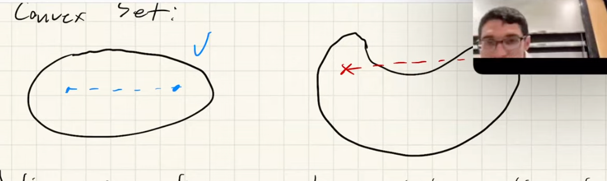

# Convex Model-Predictive Control 🚀

## Why Do We Need Convex MPC? 🤔

- **Linear Systems**: Linear Quadratic Regulator (LQR) is powerful, but it requires the state to remain close to the linearization point.
- **Constraints**: 
    - LQR often overlooks constraints.
    - Many constraints, like torque limits, can be encoded as a convex set. However, when minimizing the state value function, these constraints might lead to non-analytical solutions.
    - Forward rollouts make constraints imposed on `x` challenging to satisfy.
    - Constraints disrupt the Riccati solution, but we can still solve the Quadratic Programming (QP) online.
        - All constraints can be represented in the form Cx ≤ d.
        - This can be solved using augmented Lagrange methods.
- **Computational Efficiency**: As computers have become faster, Convex MPC has gained immense popularity. By converting to QP, we can exploit the sparsity of the Hessian matrix to accelerate computation.

## Understanding Convexity 📐

- **Convex Set**: A set where any line segment between two points in the set lies entirely within the set.

    

- **Convex Function**: A function where any line segment between two points on the graph of the function lies above or on the graph.
- **Convex Optimization**: The process of optimizing a convex function over a convex set.
- **Examples**:
    - Linear Programming (LP): Linear objective function with linear constraints.
    - Quadratic Programming (QP): Quadratic objective function with linear constraints.
    - Quadratic-Constrained QP: Quadratic objective function with ellipsoid constraints.
    - Second-Order Cone Program (SOCP): Linear objective function with cone constraints.
- **Advantages of Convexity**:
    - Local optima are equivalent to global optima.
    - Guaranteed bounded running time with Newton’s method.

## Diving into Convex MPC 🌊

- **Overview**:
    - Think of this as a constrained LQR. Is MPC a dynamic system model method or a controller that can be applied to solve constrained LQR?
    - Like Dynamic Programming (DP), with a cost-to-go function, we can determine the optimal `u` with a one-step optimization: $u_n = \argmin_u{l(x_n,u)-V_{n+1}(f(x_n, u))}$. However, adding constraints makes this hard to solve since `V` doesn't account for constraints.
    - MPC uses multiple steps to compute the cost-to-go function for linear dynamics, assuming the cost function in subsequent steps becomes more accurate as control converges.

    $$
    \min_{x_{1:H},u_{1:H-1}}{\sum_{n=1}^{H-1}{(\frac{1}{2}x_n^T Q_n x_n + \frac{1}{2}u_n^T R_n u_n) }} + \underbrace{x_H^T P_H x_H}_{\text{LQR cost-to-go}}
    $$

- **Key Insights**:
    - This approach shares similarities with Monte Carlo tree search.
    - Without additional constraints, MPC (or “receding horizon” control) aligns with LQR.
    - A longer horizon provides a better approximation of the value function.
        - `H=1` leads to non-constrained LQR.
        - `H=N` results in fully constrained MPC, which is higher-dimensional and more challenging to solve.
    - The intuition is that with explicit constrained optimization, the initial `H` steps will more closely follow the reference trajectory.
- **Effectiveness of MPC**:
    - A good approximation of `V(x)` is crucial for optimal performance.
    - A longer horizon reduces reliance on `V(x)`.
- **Handling Non-Linear Dynamics**:
    - Linearization is often effective.
    - For non-linear cases, the problem becomes non-linear, and there's no optimality guarantee.
    - With additional effort, non-linear cases can be managed effectively, even if strict optimality isn't a concern.

## Linearizing Constraints 🔗

- **Examples**: Consider constraints like the thrust of a rocket or the positioning of a quadruped's feet.
- **Technique**: Linearize a cone into a pyramid shape, which results in a linear constraint.
    - **SOCP-based MPC**: This stands for Second Order Cone Programming-based MPC, a method that leverages the linearization of constraints for optimization.

## 🚀 Infinite Horizon LQR

For the time-invariant Linear Quadratic Regulator (LQR), the feedback gain matrices, denoted by $K$, tend to converge to constant values as the time horizon approaches infinity. This property is particularly significant for the following reasons:

- 🔄 **Stabilization**: In stabilization problems, the constant $K$ is predominantly used. This is because, over an infinite horizon, the system's behavior becomes predictable with a constant feedback gain.

- 🎯 **Root-Finding as a Fixed Point Problem**: The infinite horizon LQR problem can be viewed as a fixed point problem. Specifically, the matrix $P$ for the infinite horizon converges such that $P_n = P_{n+1} = P_{\inf}$. This can be solved using iterative methods like Newton's method.

- 🛠 **Computational Tools**: Modern computational tools like Julia and Matlab provide built-in functions to solve the infinite horizon LQR problem. For instance, the `dare` function can be used to solve the Discrete Algebraic Riccati Equation, which is central to the LQR problem.

## 🎮 Controllability

Controllability is a fundamental concept in control theory. It addresses the question:

> 🤔 **How do we know if LQR will work?**

The evolution of the state $x_n$ of a system can be represented as:

$$
\begin{align*}
    x_n &= A x_{n-1} + B u_{n-1} \\
    &= A (Ax_{n-2} + B u_{n-2}) + B u_{n-1} \\
    &= A^n x_0 + A_{n-1} B u_0 + ... + B u_{n-1}\\
    &= \begin{bmatrix}
        B & AB & A^2 B & ... & A^{n-1} B
    \end{bmatrix}
    \begin{bmatrix}
        u_{n-1} \\
        u_{n-2} \\
        . \\
        . \\
        u_0
    \end{bmatrix}
    + A^n x_0
\end{align*}
$$

This leads to the definition of the **Controllability Matrix** $C$:

$$
C = \begin{bmatrix}
    B & AB & A^2 B & ... & A^{n-1} B
\end{bmatrix}
$$

For a system to be controllable, it is essential that any initial state $x_0$ can be driven to any desired state $x_n$ using appropriate control inputs. This is possible if and only if the controllability matrix $C$ has full row rank:

$$
rank(C) = n
$$

where $n$ is the dimension of the state $x$.

### 📌 Important Notes:

- **Cayley-Hamilton Theorem**: According to this theorem, $A^n = \sum_{k=0}^{n-1} \alpha_k A^k$. This implies that adding more timesteps or columns to $C$ cannot increase the rank of $C$. This theorem provides insights into the powers of matrix $A$ and their influence on the controllability of the system.