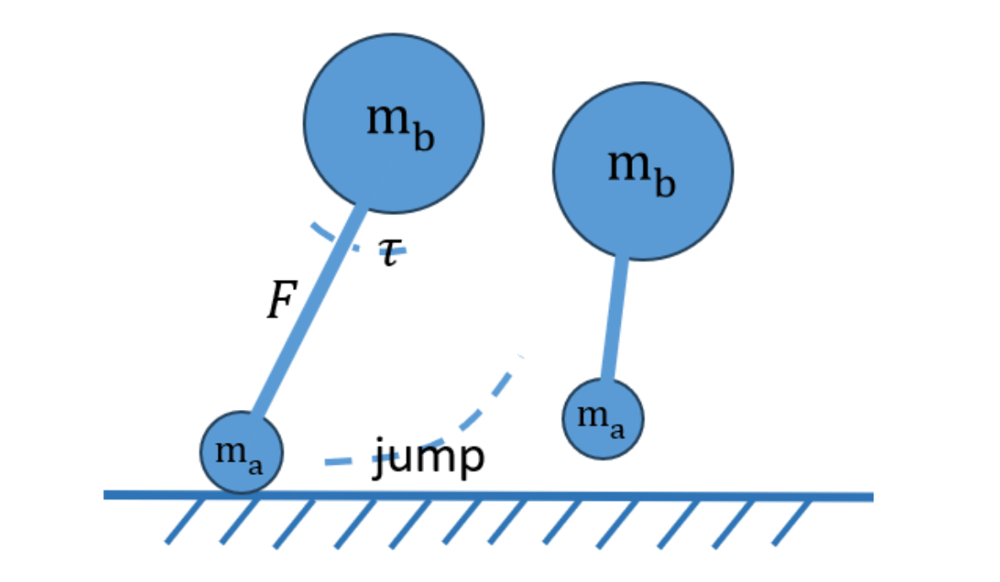
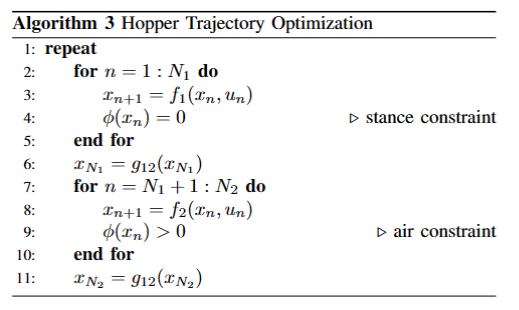

# Lecture 16 Contact Dynamics

Contact dynamics is a crucial aspect of robotics and physics simulations, especially when dealing with the sudden change of dynamic variables during contact events. This section delves into the methods to handle such dynamics.

## Dealing with Contact 🛑

### Modelling methods

There are primarily two methods to address contact dynamics:

1. **Hybrid Formulation** 🔄:
    - **Procedure**:
        1. Integrate the system.
        2. Check the guard function.
        3. Apply jump mapping when contact occurs.
        4. Continue integration.
    - **Advantages** 🌟:
        - Easy to implement using standard algorithms.
        - Just requires adding additional constraints or optimization variables during contact.
        - Highly successful in locomotion scenarios.
    - **Disadvantages** 🚫:
        - Requires a pre-specified contact mode sequence, i.e., which part of the robot is in contact at each time step.
        - Can be problematic in contact-rich scenarios.

2. **Time-Stepping Method / Contact-Implicit Formulation** ⏰:
    - **Procedure**: Formulate contact as constraints and solve a constrained optimization problem at each timestep.
    - **Advantages** 🌟:
        - No need for a pre-specified contact sequence.
    - **Disadvantages** 🚫:
        - The optimization process becomes significantly more challenging.

### Example: A Brick Falling Down 🧱

Let's understand these methods better with an example:

1. **Time-Stepping Method**:
    - **Question**: Where is the ground damping ratio?
    - **Formulation**:
        $$ 
        \begin{align*}
        \phi(q) & = [0 \; 1] [q_x \; q_y]^T \; \text{(mapping position to distance to the ground)} \\
        m\left(\frac{v_{k+1}-v_k}{h}\right) & =-mg+J^T\lambda_k \\
        p_{k+1} & = p_k+hv_{k+1} \; \text{(backward Euler)} \\
        \phi(q_{k+1}) & > 0 \; \to \; p[1] > 0 \\
        \lambda_k & \geq 0 \; \text{(contact force)} \\
        \phi(q_{k+1})\lambda_k & = 0 \; \text{(force only when hitting the ground)}
        \end{align*}
        $$
    - **Converted QP Problem**:
        - **Question**: Why is this a QP problem? (Is it due to KKT conditions?)
        $$ 
        \begin{align*}
        \min_{V_{k+1}} \ &0.5mV_{k+1}^TV_{k+1}+mV_{k+1}^T(hg-V_k) \\
        s.t.\ \ \ &J(p_k+hV_{k+1})=0 
        \end{align*}
        $$
    - **Limitations**:
        - Exact impact time isn't determined.
        - Contact forces are explicitly computed.
        - Doesn't generalize to higher-order integration (e.g., RK-4), necessitating smaller steps.
        - Complementary conditions (boundary constraints) aren't smooth.
        - Widely used in platforms like PyBullet, DART, Gazebo, etc.

2. **Hybrid Method**:
    - **Formulation**:
        $$ 
        \begin{align*}
        \text{Smooth vector field: } & [\dot{q} \; \dot{v}]^T = [v \; -g ]^T \\
        \text{Guard function:  } &  \phi(x) \ge 0 \\
        \text{Jump map: } & x' = g(x) = [q_x \; q_y \; v_x \; 0] ^T 
        \end{align*}
        $$
    - **Algorithm**:
        ```
        while t < t_final:
            if phi(x) ≥ 0:
                x_dot = f(x)
            else if phi = 0: 
                # Sometimes backtracking is needed to find the exact time
                x’ = g(x)
        end
        ```
    - **Advantages**:
        - Determines the exact impact time.
        - Can utilize high-accuracy integrators.
    - **Disadvantages**:
        - Doesn't calculate the contact force.
    - Widely used in tools like TrajOpt/MPC.
    - **Insight**: If we know the impact time in advance, we can optimize each non-constrained trajectory separately.

### Notes 📝

Both methods, despite their pros and cons, are widely used in the field of robotics and control systems.

## 🤖 Hybrid Trajectory Optimization for Legged Systems

<div style="text-align: center;">
    
</div>

### 📌 State

The state vector, \( x \), represents various parameters of the legged system:

$$
x = \begin{bmatrix} 
r_b & \text{-- body position} \\
r_f & \text{-- foot position} \\
v_b & \text{-- body velocity} \\
v_f & \text{-- foot velocity} 
\end{bmatrix} \in \mathbb{R}^8
$$

### 📌 Control

The control vector, \( u \), is used to influence the state of the system:

$$
u = \begin{bmatrix} 
F & \text{-- force} \\
\tau & \text{-- torque} 
\end{bmatrix} \in \mathbb{R}^2
$$

### 📌 Jump Map

The jump map, \( x' \), describes the transition of the system:

$$
x' = g_{21}(x) = \begin{bmatrix} 
r_b \\
f_f \\
v_b \\
0 
\end{bmatrix}
$$

By pre-specifying the contact time step, we can optimize the trajectory accordingly:

<div style="text-align: center;">
    
</div>

## 🤖 Reasoning about Frictions

To ensure the stability and safety of the legged system, it's essential to consider the frictional forces during trajectory optimization.

### 📌 Friction Limitation

The frictional force, \( b \), is constrained by the normal force, \( n \), and the coefficient of friction, \( \mu \):

$$
\|b\|_2 \leq \mu n
$$

Where:
- \( n \) is the normal force and \( n \in \mathbb{R}_+ \)
- \( b \) is the friction force and \( b \in \mathbb{R}^2 \)

### 📌 Linearizing the Friction Constraints

Since the base of the friction cone is non-differentiable, we often linearize the constraints, leading to the concept of a friction pyramid:

$$
e^T d \leq \mu n \ \ \text{where} \ \ d \in \mathbb{R}^4 \ \ \text{and} \ \ e = [1,1,1,1]^T
$$

With the additional constraints:
$$
d \geq 0
$$

And:
$$
b = [I \ -I]d
$$

### 📝 Notes
- If slipping is desired, an additional mode should be introduced.
- The friction pyramid is a coarse approximation and might not capture all the nuances of real-world frictional interactions.