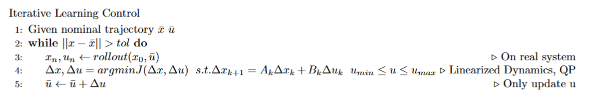

# Lecture 17 Adaptive Control

## Ways to deal with uncertainties

- Feedback
  - Feedback is a fundamental concept in control systems. It refers to the process of adjusting the input based on the output to achieve desired behavior.
  - However, feedback alone might not be sufficient, especially when constraints are tight or when the system is complex.
- Improving the Model
    - Parameter Estimation:
       - Methods: System Identification (SystemID), Grey Box Modeling.
       - 🟢 Advantages: Sample efficient and generalizes well.
       - 🔴 Disadvantages: Assumes a good model structure.
    - Learning the Model:
       - Methods: Fit the model function or use residue black-box.
       - 🟢 Advantages: No assumption on model structure and generalizes well.
       - 🔴 Disadvantages: Sample inefficient and challenging to implement in real-world scenarios.

- Improving the Controller
    - Learning the Policy:
       - 🟢 Advantages: No assumptions on dynamics.
       - 🔴 Disadvantages: Suited for single tasks, doesn't generalize well, and is sample inefficient.
    - Improving a Trajectory:
       - Given a reference trajectory with a nominal model, feedback the real trajectory to the optimizer.
       - 🟢 Advantages: Makes few assumptions and is sample efficient.
       - 🔴 Disadvantages: Assumes a decent model and doesn't generalize well.

## Iterative Learning Control 📘

Iterative Learning Control (ILC) is a fascinating area of optimal control that leverages iterative methods to improve control policies based on previous experiences. This article delves into the mathematical foundations of ILC and its practical implications.

### Overview 🌐

- **Definition**: ILC is essentially a special case of the policy gradient on a policy class. The control policy is represented as:
  
    $$
    u_k = \bar{u}_k - K_k(x_k - \bar{x}_k)
    $$
    
    where the latter can be any controller.

- **Relation to SQP**: ILC can also be seen as a special case of the Sequential Quadratic Programming (SQP) method. This is evident from the way the right-hand side vector originates from the system rollout.

### Formulation of Tracking Problem 📐

Consider the following optimization problem for tracking:

$$
\begin{align*}
\min_{x_{1:N}, u_{1:N}} & J = \sum_{n=1}^{N-1} \left[ \frac{1}{2} (x_n - \bar{x}_n)^T Q (x_n - \bar{x}_n) + \frac{1}{2} (u_n - \bar{u}_n)^T R (u_n - \bar{u}_n) \right] \\
& + \frac{1}{2} (x_N - \bar{x}_N)^T Q_N (x_N - \bar{x}_N) \\
\text{s.t.} & x_{n+1} = f_{\text{nominal}}(x_n)
\end{align*}
$$

📝 **Notes**:
- In a standard formulation, \( f_{\text{nominal}} \) should be \( f_{\text{real}} \). However, we often don't have access to \( f_{\text{real}} \). The idea is to approximate the gradient of dynamics.
- The underlying concept is to replace the model-based rollout trajectory with the real rollout trajectory. A limitation in real-world scenarios is the inability to obtain the gradient, prompting the use of the original model as an approximation.

#### Objective Gradient 📈

The Lagrangian for the problem is:

$$
L = J + \lambda^T c
$$

The gradient of the Lagrangian with respect to \( x \) and \( \lambda \) can be approximated as:

$$
\begin{align*}
L &= J + \lambda^T c \\
\nabla_x L (x + \Delta x, \lambda + \Delta \lambda) &\approx \nabla_x L (x, \lambda) + \frac{\partial^2 L}{\partial x^2} \Delta x + \frac{\partial^2 L}{\partial x \partial \lambda} \Delta \lambda \\ &=\nabla_xJ(x)+\nabla_x\lambda^T c(x)+ \frac{\partial^2 L}{\partial x^2} \Delta x + \frac{\partial c}{\partial x} \Delta \lambda\\ &=\nabla_xJ(x)+\frac{\partial c}{\partial x}\lambda+ \frac{\partial^2 L}{\partial x^2} \Delta x + \frac{\partial c}{\partial x} \Delta \lambda\\ &= \nabla_xJ(x)+\frac{\partial c}{\partial x}\lambda_{new}+ \frac{\partial^2 L}{\partial x^2} \Delta x \\ \nabla_{\lambda} L (x + \Delta x, \lambda) &\approx c(x) + \frac{\partial c}{\partial x} \Delta x
\end{align*}
$$

#### Hessian of KKT Condition 📊

The Hessian matrix of the Karush-Kuhn-Tucker (KKT) condition is:

$$
\begin{align*}
\begin{bmatrix}
H & \frac{\partial c(z)}{\partial z}^T \\
\frac{\partial c(z)}{\partial z} & 0 
\end{bmatrix}
\begin{bmatrix}
\Delta z \\
\lambda 
\end{bmatrix}
= 
\begin{bmatrix}
-\nabla_x J \\
-c(z) 
\end{bmatrix}
\end{align*}
$$

Where:

$$
H = \begin{bmatrix}
Q & 0 & \dots & 0 \\
0 & R & \dots & 0 \\
\vdots & \vdots & \ddots & \vdots \\
0 & 0 & \dots & Q_N 
\end{bmatrix}
$$

And:

$$
c(z) = \begin{bmatrix}
\vdots \\
f(x_n, u_n) - x_{n+1} \\
\vdots 
\end{bmatrix}
$$

📝 **Key Observations**:
- \( c(z) = 0 \) is always satisfied with real-world data.
- Given \( x_n, u_n \), we can still obtain the gradient of \( J \).
- This allows us to obtain the entire right-hand side of the KKT condition.
- In practice, since \( x_n, u_n \) are already close to the reference trajectory by offline solving, we can compute \( C = \frac{\partial c}{\partial q} |_{\bar{x},\bar{u}} \).
- We can then solve the KKT system for \( \Delta z \) and update \( \bar{u} \) using a Quadratic Programming (QP) approach.

📝 **Note**: During the rollout, we might use Linear Quadratic Regulator (LQR) to track the planned open-loop trajectory.

### Why Does ILC Work? 🤔

ILC operates as an approximation of Newton's method. It's a form of inexact or quasi-Newton method. The beauty of ILC is that it allows for Newton-style optimization even if we don't have the exact gradient. This method will converge, albeit potentially slower, as long as the approximation satisfies:

$$
\| f(x) + \frac{\partial f}{\partial x} \Delta x \| \leq \eta \| f(x) \|
$$

Where \( \eta < 0 \).

---

With the above insights, it's evident that Iterative Learning Control offers a robust framework for refining control policies iteratively, making it a valuable tool in the realm of optimal control.